# KeepyUppy - Complete Beginner's Guide

Welcome! This guide will help you download and play KeepyUppy, even if you've never used a computer for anything beyond browsing the web. We'll explain everything step by step.

---

## What is KeepyUppy?

KeepyUppy is a fun game where you keep a balloon in the air using your body! Your computer's camera watches you, and when you wave your hands, your character on screen waves too. Hit the balloon to keep it from touching the ground!


---

## What You Need (System Requirements)

### Computer Requirements

| Requirement | What This Means |
|-------------|-----------------|
| **Mac Computer** | This game works on MacBooks and iMacs running macOS 12 or newer |
| **Webcam** | Built-in camera (all MacBooks have one) or external USB camera |
| **2GB free space** | Room on your computer for the game and its components |
| **Internet** | Needed only for the initial download |

### How to Check Your macOS Version

1. Click the **Apple logo** () in the top-left corner of your screen
2. Click **"About This Mac"**
3. Look for the version number (should be 12.0 or higher)

```mermaid
flowchart TD
    A[Click  Apple Menu] --> B[Click 'About This Mac']
    B --> C{Version 12 or higher?}
    C -->|Yes| D[✅ You're good to go!]
    C -->|No| E[❌ Update your Mac first]
```



---

## Step-by-Step Setup Guide

### Overview of What We'll Do

```mermaid
flowchart TD
    A[Step 1: Open Terminal] --> B[Step 2: Install Developer Tools]
    B --> C[Step 3: Download the Game]
    C --> D[Step 4: Run the Game]
    D --> E[Step 5: Allow Camera Access]
    E --> F[🎮 Play!]
```



---

### Step 1: Open Terminal

**What is Terminal?** Terminal is like a text message chat with your computer. Instead of clicking buttons, you type commands.

**How to open it:**

1. Press **Command (⌘) + Spacebar** together (this opens Spotlight Search)
2. Type: `Terminal`
3. Press **Enter** or click on "Terminal" when it appears

You'll see a window with text that looks something like:
```
yourname@MacBook ~ %
```

This is where you'll type commands. Don't worry - we'll tell you exactly what to type!


---

### Step 2: Check for Python

**What is Python?** Python is a programming language. The game is written in Python, so your computer needs it to run the game. Most Macs have it already!

**Check if you have Python:**

Type this command and press Enter:
```bash
python3 --version
```

**What you might see:**

| You See | What It Means |
|---------|---------------|
| `Python 3.9.6` (or any 3.x number) | Great! Python is installed. Skip to Step 3! |
| `command not found` | Python isn't installed. Follow the instructions below. |

**If Python isn't installed:**

Type this command and press Enter:
```bash
xcode-select --install
```

A popup will appear. Click **"Install"** and wait (this can take 5-10 minutes).

---

### Step 3: Download the Game

Now we'll download the game from the internet. Type this command and press Enter:

```bash
cd ~/Desktop && git clone https://github.com/ikirugai/KeepyUppy.git
```

**What this does:**
- `cd ~/Desktop` = Go to your Desktop folder
- `git clone ...` = Download the game

You'll see some text scrolling. When it stops and you see `yourname@MacBook ~ %` again, it's done!

You should now see a folder called **"KeepyUppy"** on your Desktop.


---

### Step 4: Run the Game

**Navigate to the game folder:**
```bash
cd ~/Desktop/KeepyUppy
```

**Start the game:**
```bash
./run_game.sh
```

**First time running?** The game will:
1. Set up a virtual environment (a safe space for the game's components)
2. Download required components (this takes 1-2 minutes)
3. Start the game!

```mermaid
flowchart TD
    A[run_game.sh] --> B{First time?}
    B -->|Yes| C[Create virtual environment]
    C --> D[Download components]
    D --> E[Start game]
    B -->|No| E
    E --> F[🎮 Game window opens!]
```



---

### Step 5: Allow Camera Access

**Important!** The first time you play, your Mac will ask permission to use the camera.

```mermaid
flowchart TD
    A[Game tries to access camera] --> B[Mac shows permission popup]
    B --> C{Click Allow?}
    C -->|Yes| D[✅ Camera works!]
    C -->|No| E[❌ Game can't see you]
    E --> F[Go to System Settings to fix]
```



**If you accidentally clicked "Don't Allow":**

1. Click the **Apple logo** () → **System Settings**
2. Click **Privacy & Security** (in the left sidebar)
3. Click **Camera**
4. Find **Terminal** in the list and turn it **ON**

---

## How to Play

### Game Flow


### Controls

| Key | What It Does |
|-----|--------------|
| **SPACE** | Start game / Play again |
| **ESC** | Pause the game / Quit |
| **R** | Restart the game |
| **Your hands** | Wave them to hit the balloon! |

### Tips for Playing

1. **Stand back** - Make sure your whole upper body is visible to the camera
2. **Good lighting** - Play in a well-lit room so the camera can see you clearly
3. **Clear space** - Make sure you have room to wave your arms around!
4. **Watch the balloon** - It moves with gravity and random wind gusts

### Scoring

- Your score is based on how long you keep the balloon in the air
- The timer shows seconds and milliseconds
- Try to beat your high score!

### Characters

Up to 4 players can play at once! Each player appears as a different character:

| Player | Character |
|--------|-----------|
| Player 1 | 🐕 Bluey |
| Player 2 | 🐕 Bingo |
| Player 3 | 🐕 Bandit (Dad) |
| Player 4 | 🐕 Chilli (Mum) |

---

## Troubleshooting

### Common Problems and Solutions

```mermaid
flowchart TD
    A[Problem?] --> B{What's wrong?}
    B -->|Camera not working| C[Check camera permissions]
    B -->|Game runs slowly| D[Close other apps]
    B -->|Can't download game| E[Check internet connection]
    B -->|Command not found| F[Check spelling carefully]
    C --> G[System Settings → Privacy → Camera → Enable Terminal]
    D --> H[Reduce window size with --width 800 --height 600]
```



### "Camera not detected"

**Try these steps:**
1. Check if another app is using the camera (close FaceTime, Zoom, etc.)
2. Check camera permissions (see Step 5 above)
3. Try unplugging and replugging your camera (if external)
4. Restart your Mac

### "Permission denied" when running the game

Type this command first:
```bash
chmod +x run_game.sh
```
Then try running the game again.

### Game is slow or choppy

Try running with a smaller window:
```bash
python3 main.py --width 800 --height 600
```

### "No module named..." error

The game components might not have installed properly. Try:
```bash
source venv/bin/activate
pip install -r requirements.txt
```

### Nothing happens when I wave my hands

- Make sure you can see yourself in the game (your body should be tracked)
- Stand further from the camera so your whole torso is visible
- Check that you're in a well-lit room
- Try waving more dramatically!

---

## Playing Again Later

Once you've set up the game, playing again is easy!


**Quick commands:**
```bash
cd ~/Desktop/KeepyUppy
./run_game.sh
```

---

## Uninstalling the Game

If you want to remove the game completely:

1. Delete the **KeepyUppy** folder from your Desktop (drag it to Trash)
2. That's it! Everything was contained in that folder.

---

## Getting Help

If something isn't working:

1. **Re-read this guide** - Make sure you didn't skip a step
2. **Check the troubleshooting section** above
3. **Report an issue** at: https://github.com/ikirugai/KeepyUppy/issues

---

## Quick Reference Card

```
┌─────────────────────────────────────────────────┐
│              KEEPYUPPY QUICK START              │
├─────────────────────────────────────────────────┤
│                                                 │
│  FIRST TIME SETUP:                              │
│  1. Open Terminal (⌘ + Space, type "Terminal") │
│  2. cd ~/Desktop                                │
│  3. git clone https://github.com/ikirugai/KeepyUppy.git │
│  4. cd KeepyUppy                                │
│  5. ./run_game.sh                               │
│                                                 │
├─────────────────────────────────────────────────┤
│                                                 │
│  PLAY AGAIN:                                    │
│  1. Open Terminal                               │
│  2. cd ~/Desktop/KeepyUppy                      │
│  3. ./run_game.sh                               │
│                                                 │
├─────────────────────────────────────────────────┤
│                                                 │
│  CONTROLS:                                      │
│  SPACE = Start/Restart                          │
│  ESC   = Pause/Quit                             │
│  R     = Restart                                │
│  HANDS = Wave to hit balloon!                   │
│                                                 │
└─────────────────────────────────────────────────┘
```

---

Have fun keeping that balloon up! 🎈🐕
